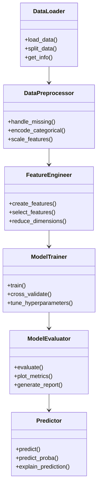

# 🎓 Dashboard Interactivo - Aprendizaje Supervisado

<div align="center">


**Dashboard interactivo que integra algoritmos de Machine Learning supervisado con una arquitectura POO modular**

[Demo en Vivo](#) • [Documentación](#) • [Reportar Bug](../../issues) • [Solicitar Feature](../../issues)

</div>

---

## 📋 Descripción

Dashboard educativo e interactivo desarrollado en Python que implementa una suite completa de algoritmos de aprendizaje supervisado. El proyecto combina teoría y práctica de Machine Learning con principios de Programación Orientada a Objetos, ofreciendo una interfaz amigable construida con Streamlit.

### 🎯 Objetivo Principal

Desarrollar un sistema completo de predicción de precios de propiedades utilizando el dataset de King County, implementando un pipeline de ML desde la exploración de datos hasta el deployment de modelos.

---

## ✨ Características Principales

### 🤖 Algoritmos Implementados

| Algoritmo | Tipo | Uso Principal | Complejidad |
|-----------|------|---------------|-------------|
| **Regresión Lineal** | Regresión | Predicción de valores continuos | ⭐ Básico |
| **Ridge & Lasso** | Regresión | Regularización L1/L2 | ⭐⭐ Intermedio |
| **Regresión Logística** | Clasificación | Problemas binarios/multiclase | ⭐⭐ Intermedio |
| **K-Nearest Neighbors** | Ambos | Clasificación basada en similitud | ⭐⭐ Intermedio |
| **Árboles de Decisión** | Ambos | Modelos interpretables | ⭐⭐ Intermedio |
| **Redes Neuronales** | Ambos | Problemas no lineales complejos | ⭐⭐⭐ Avanzado |

### 🏡 Proyecto Integrador: Predicción de Precios Inmobiliarios

- **Dataset**: King County House Sales (21,000+ propiedades)
- **Variables**: 21 características (área, ubicación, año construcción, etc.)
- **Target**: Precio de venta en USD
- **Pipeline completo**: EDA → Preprocesamiento → Feature Engineering → Modelado → Evaluación → Deployment

---

## 🛠️ Stack Tecnológico

<table>
<tr>
<td>

**Backend & ML**
- Python 3.8+
- scikit-learn 1.3+
- pandas 2.0+
- numpy 1.24+
- matplotlib/seaborn

</td>
<td>

**Frontend**
- Streamlit 1.28+
- Plotly 5.17+
- Altair 5.1+

</td>
<td>

**Arquitectura**
- POO (SOLID)
- MVC Pattern
- Modular Pipeline
- Type Hints

</td>
</tr>
</table>

---

## 📁 Estructura del Proyecto

```
ml-dashboard/
│
├── 📄 main_dashboard.py          # Aplicación principal Streamlit
├── 📄 requirements.txt           # Dependencias Python
├── 📄 README.md                  # Documentación principal
├── 📄 .gitignore                 # Archivos ignorados por Git
│
├── 📂 data/
│   ├── king_county.csv           # Dataset principal
│   └── README.md                 # Descripción del dataset
│
├── 📂 scripts/
│   ├── __init__.py
│   ├── data_loader.py            # Carga de datos
│   ├── data_preprocessor.py      # Limpieza y transformación
│   ├── feature_engineer.py       # Ingeniería de características
│   ├── model_trainer.py          # Entrenamiento de modelos
│   ├── model_evaluator.py        # Evaluación y métricas
│   └── predictor.py              # Sistema de predicción
│
├── 📂 models/
│   └── saved_models/             # Modelos entrenados (.pkl)
│
├── 📂 notebooks/
│   ├── 01_exploratory_analysis.ipynb
│   ├── 02_feature_engineering.ipynb
│   └── 03_model_comparison.ipynb
│
├── 📂 tests/
│   ├── test_data_loader.py
│   ├── test_preprocessor.py
│   └── test_models.py
│
└── 📂 docs/
    ├── architecture.md           # Diagrama de arquitectura
    ├── algorithms.md             # Guía de algoritmos
    └── api_reference.md          # Referencia de API
```

---

## 🏗️ Arquitectura POO

### Diagrama de Clases



### Responsabilidades de Clases

#### 🔵 `DataLoader`
**Propósito**: Gestión de carga y partición de datos

```python
- load_data(filepath: str) -> pd.DataFrame
- split_data(test_size: float, random_state: int) -> tuple
- get_dataset_info() -> dict
```

#### 🟢 `DataPreprocessor`
**Propósito**: Limpieza y transformación de datos

```python
- handle_missing_values(strategy: str) -> pd.DataFrame
- encode_categorical(method: str) -> pd.DataFrame
- scale_features(scaler_type: str) -> np.ndarray
- remove_outliers(method: str) -> pd.DataFrame
```

#### 🟡 `FeatureEngineer`
**Propósito**: Creación y selección de características

```python
- create_polynomial_features(degree: int) -> pd.DataFrame
- create_interaction_features() -> pd.DataFrame
- select_features(method: str, k: int) -> list
- reduce_dimensions(method: str) -> np.ndarray
```

#### 🔴 `ModelTrainer`
**Propósito**: Entrenamiento y optimización de modelos

```python
- train(algorithm: str, params: dict) -> object
- cross_validate(cv: int) -> dict
- hyperparameter_tuning(param_grid: dict) -> dict
- save_model(filepath: str) -> None
```

#### 🟣 `ModelEvaluator`
**Propósito**: Evaluación exhaustiva de modelos

```python
- evaluate(y_true, y_pred) -> dict
- plot_confusion_matrix() -> None
- plot_learning_curves() -> None
- generate_classification_report() -> str
```

#### 🟠 `Predictor`
**Propósito**: Realizar predicciones en producción

```python
- predict(X_new: pd.DataFrame) -> np.ndarray
- predict_proba(X_new: pd.DataFrame) -> np.ndarray
- explain_prediction(instance: pd.Series) -> dict
```

---

## 📊 Métricas de Evaluación

### Para Problemas de Regresión

| Métrica | Fórmula | Interpretación | Mejor Valor |
|---------|---------|----------------|-------------|
| **MSE** | `Σ(y - ŷ)² / n` | Error cuadrático promedio | 0 |
| **RMSE** | `√MSE` | Error en unidades originales | 0 |
| **MAE** | `Σ\|y - ŷ\| / n` | Error absoluto promedio | 0 |
| **R²** | `1 - (SS_res / SS_tot)` | Varianza explicada | 1 |
| **MAPE** | `Σ\|y - ŷ\|/y / n × 100` | Error porcentual | 0% |

### Para Problemas de Clasificación

| Métrica | Fórmula | Interpretación | Mejor Valor |
|---------|---------|----------------|-------------|
| **Accuracy** | `(TP + TN) / Total` | Predicciones correctas | 1.0 |
| **Precision** | `TP / (TP + FP)` | Positivos correctos | 1.0 |
| **Recall** | `TP / (TP + FN)` | Cobertura de positivos | 1.0 |
| **F1-Score** | `2 × (P × R) / (P + R)` | Media armónica P y R | 1.0 |
| **ROC-AUC** | Área bajo curva ROC | Capacidad discriminante | 1.0 |

---

## 🚀 Instalación y Configuración

### Prerrequisitos

- Python 3.8 o superior
- pip (gestor de paquetes)
- Git
- 4GB RAM mínimo
- 500MB espacio en disco

### Instalación Paso a Paso

#### 1️⃣ Clonar el Repositorio

```bash
git clone https://github.com/tu-usuario/ml-dashboard.git
cd ml-dashboard
```

#### 2️⃣ Crear Entorno Virtual

```bash
# Linux/MacOS
python3 -m venv venv
source venv/bin/activate

# Windows
python -m venv venv
venv\Scripts\activate
```

#### 3️⃣ Instalar Dependencias

```bash
pip install --upgrade pip
pip install -r requirements.txt
```

#### 4️⃣ Verificar Instalación

```bash
python -c "import streamlit; import sklearn; print('✅ Todo listo!')"
```

#### 5️⃣ Ejecutar Dashboard

```bash
streamlit run main_dashboard.py
```

#### 6️⃣ Acceder a la Aplicación

Abrir navegador en: **http://localhost:8501**

---

## 💻 Uso del Dashboard

### Flujo de Trabajo

1. **📁 Carga de Datos**: Subir dataset o usar King County
2. **🔍 Análisis Exploratorio**: Visualizar distribuciones y correlaciones
3. **🧹 Preprocesamiento**: Limpiar, transformar y escalar datos
4. **⚙️ Feature Engineering**: Crear nuevas características
5. **🤖 Selección de Modelo**: Elegir algoritmo y configurar hiperparámetros
6. **📊 Evaluación**: Analizar métricas y visualizaciones
7. **🔮 Predicción**: Realizar predicciones sobre nuevos datos

### Ejemplo de Código

```python
from scripts.data_loader import DataLoader
from scripts.model_trainer import ModelTrainer

# Cargar datos
loader = DataLoader()
X_train, X_test, y_train, y_test = loader.load_and_split('data/king_county.csv')

# Entrenar modelo
trainer = ModelTrainer()
model = trainer.train('ridge', {'alpha': 1.0})

# Evaluar
metrics = trainer.evaluate(X_test, y_test)
print(f"R² Score: {metrics['r2']:.3f}")
```

---

## 🎯 Guía de Algoritmos

### 📈 Regresión Lineal

**Cuándo usar**: Relaciones lineales entre variables, interpretabilidad crítica

**Ventajas**: Simple, rápido, interpretable, bajo riesgo de overfitting

**Limitaciones**: Asume linealidad, sensible a outliers

**Aplicaciones**: Predicción de ventas, precios, demanda

### 🎯 Regresión Logística

**Cuándo usar**: Clasificación binaria, necesitas probabilidades de clase

**Ventajas**: Salida probabilística, interpretable, eficiente

**Limitaciones**: Límite de decisión lineal

**Aplicaciones**: Detección de spam, diagnóstico médico, credit scoring

### 👥 K-Nearest Neighbors

**Cuándo usar**: Pocas features, patrones locales, no requiere entrenamiento

**Ventajas**: No paramétrico, simple, adaptativo

**Limitaciones**: Lento en predicción, sensible a escala y dimensionalidad

**Aplicaciones**: Sistemas de recomendación, reconocimiento de patrones

### 🌳 Árboles de Decisión

**Cuándo usar**: Interpretabilidad crucial, datos con tipos mixtos

**Ventajas**: Muy interpretable, no requiere normalización, captura no linealidad

**Limitaciones**: Propenso a overfitting, inestable

**Aplicaciones**: Análisis de riesgo crediticio, diagnóstico médico

### 🧠 Redes Neuronales

**Cuándo usar**: Patrones complejos no lineales, grandes volúmenes de datos

**Ventajas**: Alta capacidad de modelado, feature extraction automático

**Limitaciones**: Caja negra, requiere muchos datos, computacionalmente costoso

**Aplicaciones**: Computer vision, NLP, series temporales complejas

---

## 🔍 Validación y Prevención de Overfitting

### Técnicas Implementadas

- ✅ **Train/Validation/Test Split** (70/15/15)
- ✅ **K-Fold Cross-Validation** (k=5, 10)
- ✅ **Stratified K-Fold** para clases desbalanceadas
- ✅ **Grid Search & Random Search** para hiperparámetros
- ✅ **Learning Curves** para diagnóstico

### Estrategias Anti-Overfitting

| Técnica | Aplicable a | Cómo Funciona |
|---------|-------------|---------------|
| **Regularización L1/L2** | Regresión, Logística | Penaliza coeficientes grandes |
| **Early Stopping** | Redes Neuronales | Detiene entrenamiento óptimo |
| **Pruning** | Árboles | Poda ramas menos relevantes |
| **Dropout** | Redes Neuronales | Desactiva neuronas aleatoriamente |
| **Ensemble Methods** | Todos | Combina múltiples modelos |

---

## 📈 Resultados del Proyecto Principal

### Predicción de Precios Inmobiliarios

| Modelo | R² Score | RMSE | MAE | Tiempo |
|--------|----------|------|-----|--------|
| **Regresión Lineal** | 0.698 | $181,452 | $117,832 | 0.05s |
| **Ridge (α=1.0)** | 0.698 | $181,423 | $117,795 | 0.06s |
| **Lasso (α=100)** | 0.697 | $181,632 | $117,921 | 0.08s |
| **Árbol de Decisión** | 0.732 | $170,893 | $98,442 | 0.15s |
| **Red Neuronal** | **0.856** | **$125,234** | **$82,103** | 2.34s |

### Variables Más Importantes

1. 🏠 **sqft_living** (28.3%) - Metros cuadrados habitables
2. 📍 **grade** (18.7%) - Calificación de construcción
3. 📅 **yr_built** (12.4%) - Año de construcción
4. 🛏️ **bedrooms** (9.8%) - Número de habitaciones
5. 🌊 **waterfront** (8.2%) - Vista al agua

---

## 🤝 Contribución

### Pautas de Desarrollo

- ✅ Seguir principios **SOLID**
- ✅ Documentar con **docstrings** (Google style)
- ✅ Type hints en todas las funciones
- ✅ Tests unitarios con cobertura >80%
- ✅ Convención de nombres: `snake_case` para funciones/variables

### Flujo de Trabajo Git

```bash
# 1. Fork del proyecto
git clone https://github.com/tu-usuario/ml-dashboard.git

# 2. Crear rama feature
git checkout -b feature/nueva-funcionalidad

# 3. Realizar cambios y commits
git add .
git commit -m "feat: agregar algoritmo Random Forest"

# 4. Push a tu fork
git push origin feature/nueva-funcionalidad

# 5. Crear Pull Request en GitHub
```

### Convención de Commits

- `feat:` Nueva funcionalidad
- `fix:` Corrección de bug
- `docs:` Documentación
- `style:` Formato de código
- `refactor:` Refactorización
- `test:` Agregar tests

---

## 📚 Recursos Adicionales

### Documentación
- [Scikit-learn User Guide](https://scikit-learn.org/stable/user_guide.html)
- [Streamlit Documentation](https://docs.streamlit.io/)
- [Pandas Documentation](https://pandas.pydata.org/docs/)

### Tutoriales
- [Machine Learning Crash Course - Google](https://developers.google.com/machine-learning/crash-course)
- [Kaggle Learn](https://www.kaggle.com/learn)
